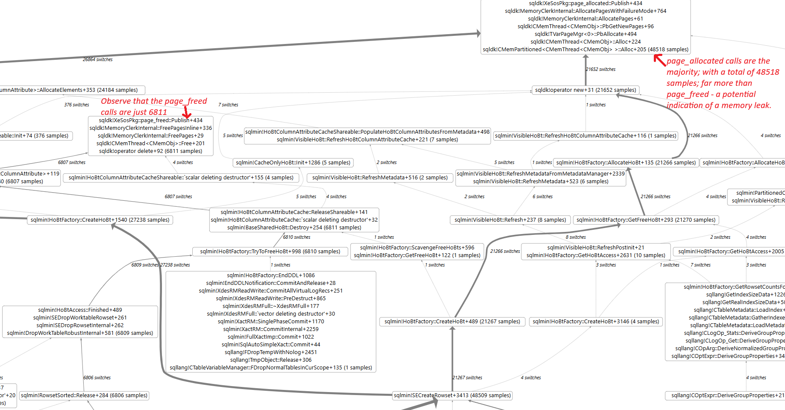
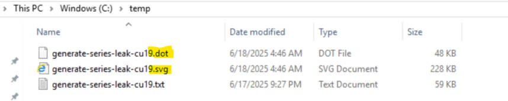
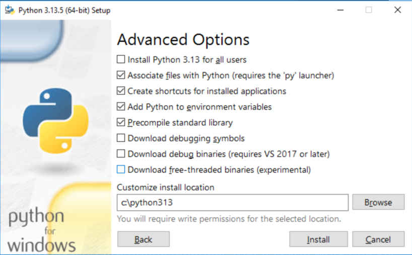
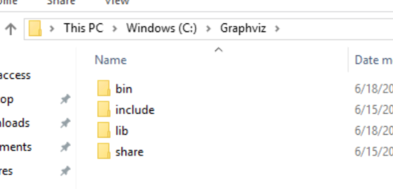
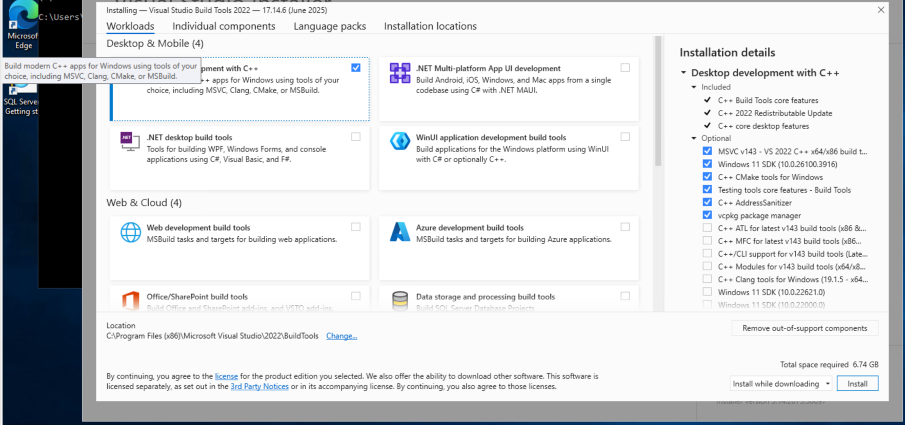

# Introduction
This repo provides a script which construct a visual call graph representation of a set of call stacks. It's currently optimized for SQL Server call stacks symbolized by [SQLCallStackResolver](https://aka.ms/SQLStack). Users can use these generated call graphs to visually understand the flow in the SQL Server functions being executed in their scenario. Call graphs can be especially useful to diagnose memory leaks. An example of such a visualized call graph for a memory leak case is shown below. The intuition behind using these call graphs is to follow the thicker connections in the graph - thick lines indicate high rate of calls of those functions. If there are equal or comparable calls to new() and free() - conceptually speaking - then you may conclude there's no leak; in this specific case, there's hardly any calls to free(); indicating a potential memory leak.



# Usage
First, ensure you have installed the pre-requisites. Then, just run export-callgraph-graphviz.py with the full path to the file containing the call stacks to be visualized.

```
cd C:\SCSR-Graphs
python .\src\export-callgraph-graphviz.py C:\temp\generate-series-leak-cu19.txt
```
The script will output 2 files - a DOT file, which is in standard GraphViz format; and a SVG file which can be viewed in your browser, or in more specialized tools like [InkScape](https://inkscape.org). Here is a sample screenshot of the output files:



# Installation on Windows

* Clone this repo to `C:\SCSR-Graphs`

* Install [Python 3.13.5 for Windows](https://www.python.org/ftp/python/3.13.5/python-3.13.5-amd64.exe). Ensure the "Add Python to environmental variables" checkbox is selected.



* Download [GraphViz for Windows](https://gitlab.com/api/v4/projects/4207231/packages/generic/graphviz-releases/13.0.1/windows_10_cmake_Release_Graphviz-13.0.1-win64.zip) and extract it to a folder like `C:\GraphViz`.



* Add the GraphViz `bin` folder to the system PATH variable.

```powershell
[System.Environment]::SetEnvironmentVariable("Path", $env:Path + ";C:\GraphViz\bin", [System.EnvironmentVariableTarget]::User)
```

* Install [Visual C++ Build Tools](https://aka.ms/vs/17/release/vs_BuildTools.exe) and restart Windows if prompted to, at the end of the installation.



* Install PyGraphViz using pip by running the following command within a PowerShell window:

```powershell
python -m pip install --config-settings="--global-option=build_ext" `
              --config-settings="--global-option=-IC:\Graphviz\include" `
              --config-settings="--global-option=-LC:\Graphviz\lib" `
              pygraphviz
```
If all goes well, you should see output like this:
```
Collecting pygraphviz
  Downloading pygraphviz-1.14.tar.gz (106 kB)
  Installing build dependencies ... done
  Getting requirements to build wheel ... done
  Preparing metadata (pyproject.toml) ... done
Building wheels for collected packages: pygraphviz
  Building wheel for pygraphviz (pyproject.toml) ... done
  Created wheel for pygraphviz: filename=pygraphviz-1.14-cp313-cp313-win_amd64.whl size=99715 sha256=2a522da02aa4c1c78708dd2a7cecc7ef0bc3deb0ff7694b96b28a3a341319695
  Stored in directory: c:\users\myuser\appdata\local\pip\cache\wheels\20\62\e8\1c65bd9a08c9473ba98a15c4c7f62132ef090acec34b69a881
Successfully built pygraphviz
Installing collected packages: pygraphviz
Successfully installed pygraphviz-1.14
```

* Install the other requirements for this repo:
```powershell
cd C:\SCSR-Graphs
pip install -r .\src\requirements.txt
```
If all goes well, you should see output like this:
```
Collecting networkx (from -r .\src\requirements.txt (line 1))
  Downloading networkx-3.5-py3-none-any.whl.metadata (6.3 kB)
Collecting pydot (from -r .\src\requirements.txt (line 2))
  Downloading pydot-4.0.1-py3-none-any.whl.metadata (11 kB)
Requirement already satisfied: pygraphviz in c:\python313\lib\site-packages (from -r .\src\requirements.txt (line 3)) (1.14)
Collecting pyparsing>=3.1.0 (from pydot->-r .\src\requirements.txt (line 2))
  Downloading pyparsing-3.2.3-py3-none-any.whl.metadata (5.0 kB)
Downloading networkx-3.5-py3-none-any.whl (2.0 MB)
   ━━━━━━━━━━━━━━━━━━━━━━━━━━━━━━━━━━━━━━━━ 2.0/2.0 MB 54.0 MB/s eta 0:00:00
Downloading pydot-4.0.1-py3-none-any.whl (37 kB)
Downloading pyparsing-3.2.3-py3-none-any.whl (111 kB)
Installing collected packages: pyparsing, networkx, pydot
Successfully installed networkx-3.5 pydot-4.0.1 pyparsing-3.2.3
```

At this stage, you are ready to use the Python script!

